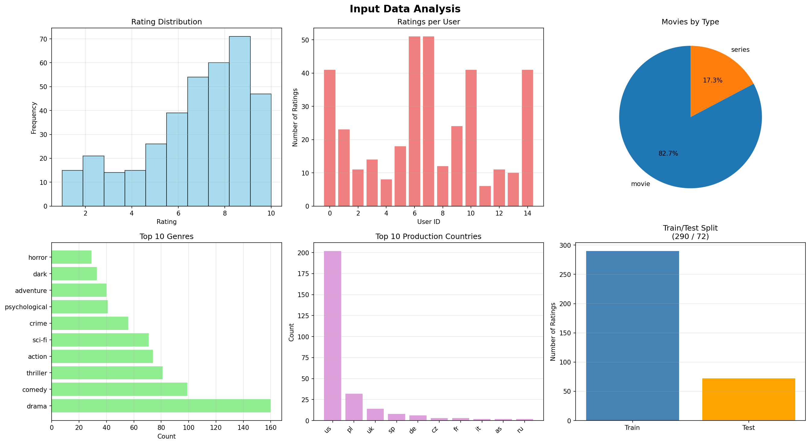
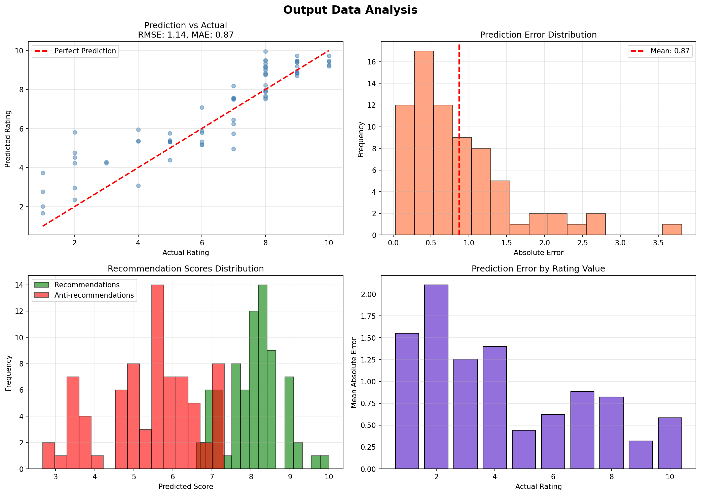
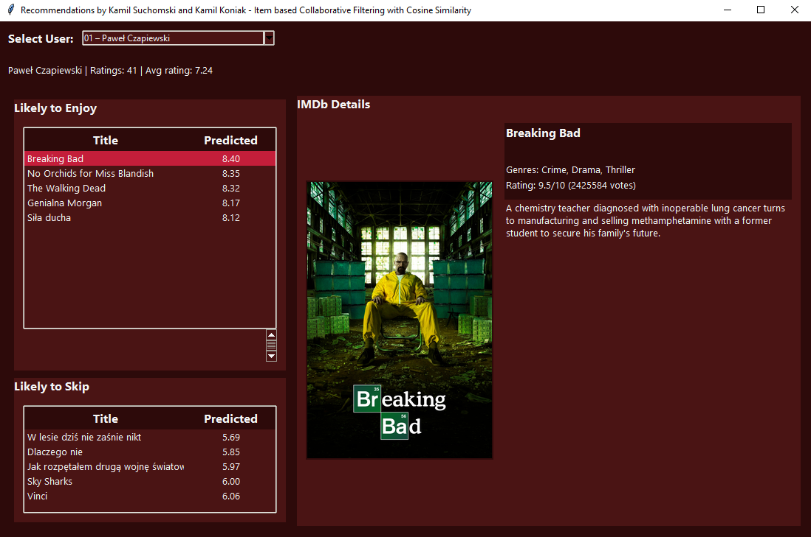
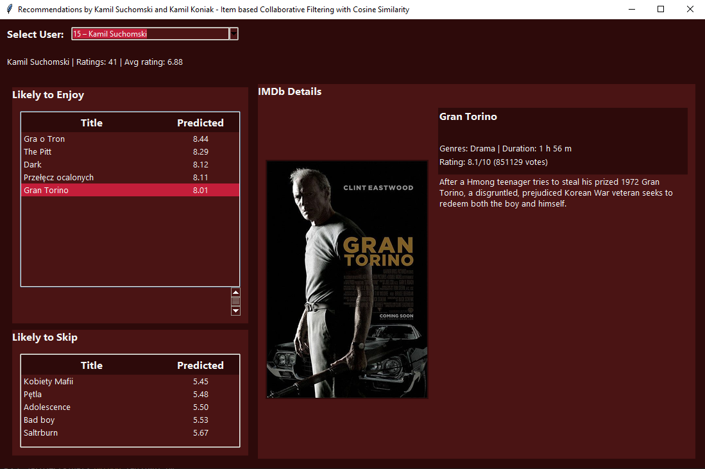
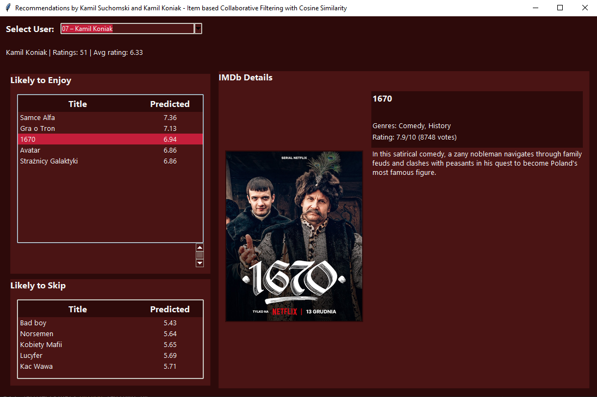

# Movie and Series Recommendation System - Lab 3 - NAI

A graphical user interface application for exploring personalized movie recommendations using Item-based Collaborative Filtering with Cosine Similarity.

**Authors:** Kamil Suchomski and Kamil Koniak

## ⚠️ IMPORTANT: Installation Required

**Before running the application, you MUST install all required dependencies!**

### Installation Steps

1. Navigate to the `lab3` directory:
   ```bash
   cd lab3
   ```

2. Install all required packages:
   ```bash
   pip install -r requirements.txt
   ```

   This will install:
   - pandas (data processing)
   - numpy (numerical operations)
   - scikit-learn (machine learning algorithms)
   - matplotlib (data visualization)
   - requests (HTTP requests for IMDb API)
   - Pillow (image processing)

## Running the Application

After installing the requirements, run the GUI application:

```bash
python gui.py
```

The application will:
- Load movie and rating data
- Train the recommendation model
- Display a user-friendly interface for exploring recommendations

## Features

- **User Selection**: Choose from available users via dropdown menu
- **Personalized Recommendations**: View top 5 movies the user is likely to enjoy
- **Anti-Recommendations**: View top 5 movies the user is unlikely to enjoy
- **IMDb Integration**: Click on any recommended movie to see detailed information including:
  - Movie poster
  - Title and alternate title
  - Genres and duration
  - IMDb rating and vote count
  - Full description
- **Modern Dark Red Theme**: Beautiful, modern interface design

## Project Structure

```
lab3/
├── gui.py                      # Main GUI application
├── recommender.py              # Recommendation model implementation
├── helper.py                   # Utility functions and data loading
├── imdb.py                     # IMDb API integration
├── requirements.txt            # Python dependencies
├── README.md                   # This file
├── data/
│   ├── movies.csv             # Movie metadata
│   ├── ratings.csv            # User ratings
│   ├── users.csv              # User information
│   └── links.csv              # IMDb links
├── input_data_analysis.png    # Input data visualization
├── output_data_analysis.png   # Output data visualization
├── use_case1.png              # Use case example 1
├── use_case2.png              # Use case example 2
└── use_case3.png              # Use case example 3
```

## Algorithm

The recommendation system uses **Item-based Collaborative Filtering with Cosine Similarity**:

- **Hybrid Approach**: Combines collaborative filtering (70%) with content-based features (30%)
- **Content Features**: Considers genres, type, and production country
- **Similarity Metric**: Cosine similarity between items
- **Prediction**: Weighted average of ratings from similar items

## Requirements

- Python 3.8 or higher
- All packages listed in `requirements.txt`
- Internet connection (for IMDb API calls)

## Data Analysis Visualizations

The application generates comprehensive data analysis plots:

### Input Data Analysis



This visualization shows:
- Rating distribution across all users
- Number of ratings per user
- Movies by type (movie vs series)
- Top 10 genres
- Top 10 production countries
- Train/Test data split

### Output Data Analysis



This visualization shows:
- Prediction vs Actual ratings (scatter plot)
- Prediction error distribution
- Recommendation scores distribution (recommendations vs anti-recommendations)
- Prediction accuracy by rating value

## Use Cases

### Use Case 1



### Use Case 2



### Use Case 3



## Notes

- The application caches IMDb data to avoid redundant API calls
- Movie data is loaded from CSV files in the `data/` directory
- The model is trained on the full dataset when the GUI starts
- Recommendations are generated in real-time based on user selection

