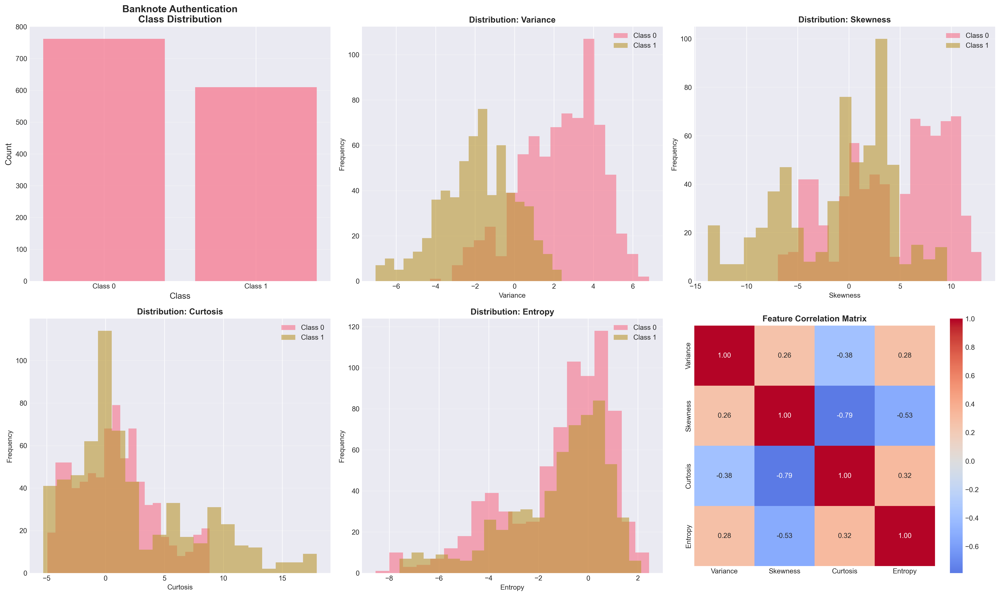
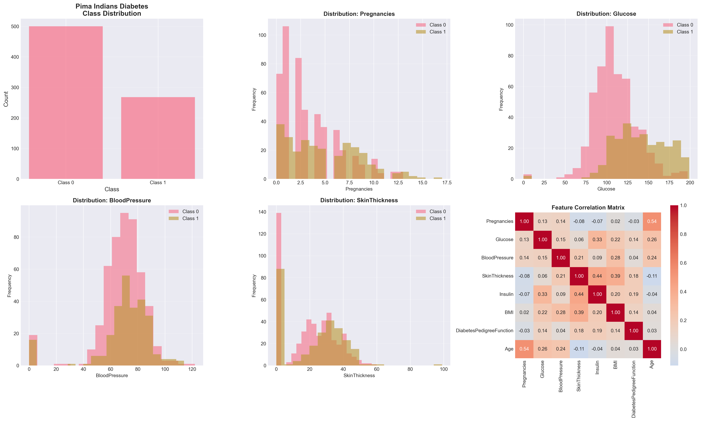
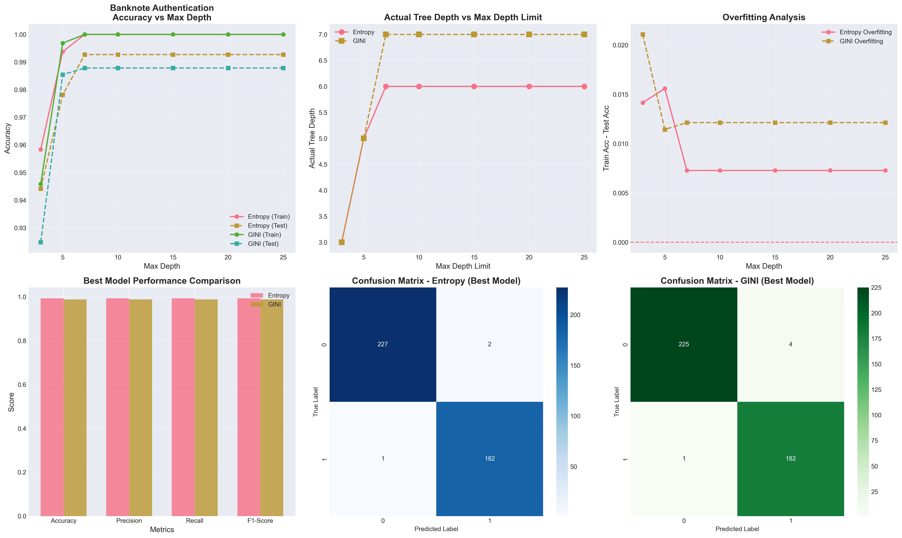
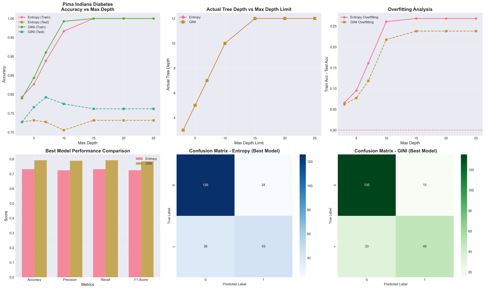
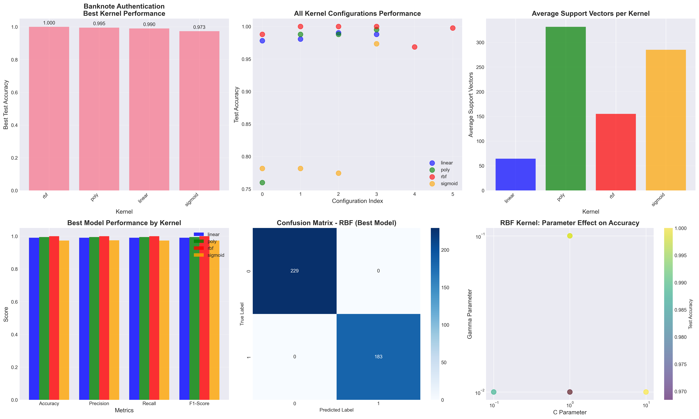
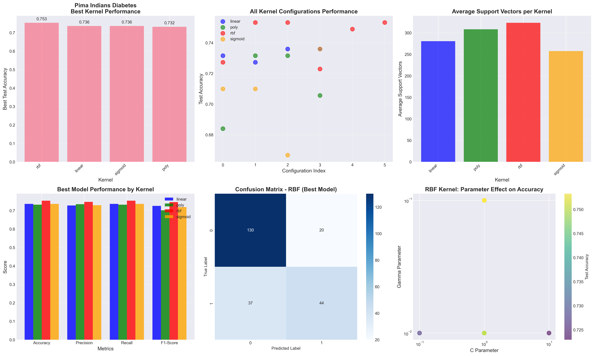
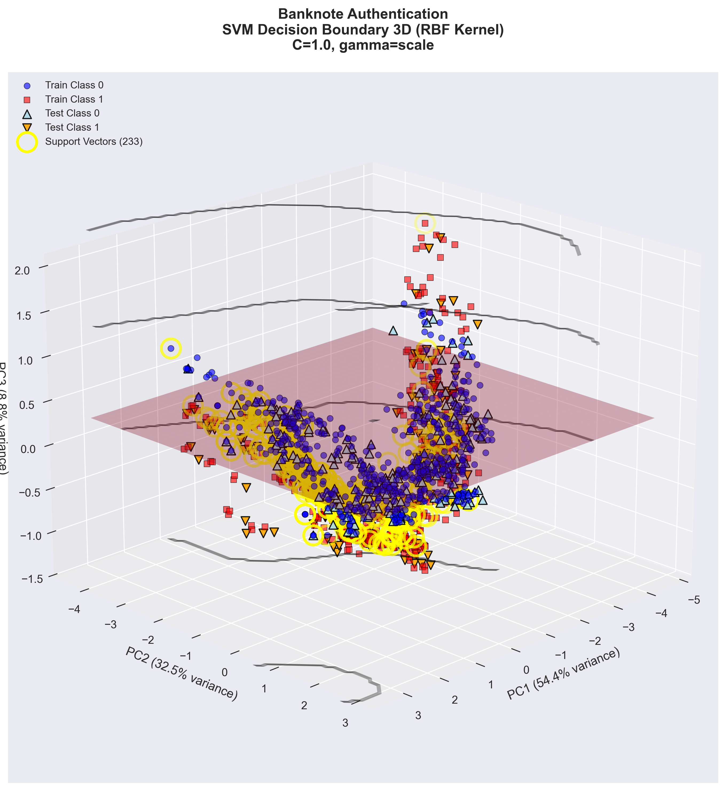
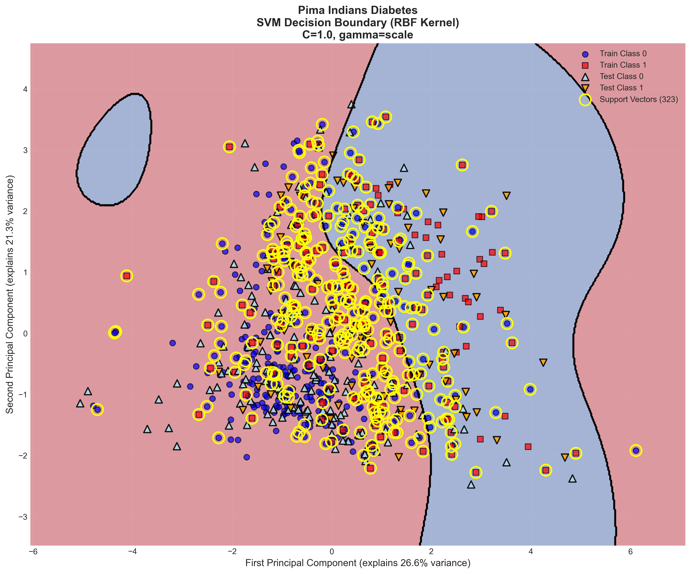
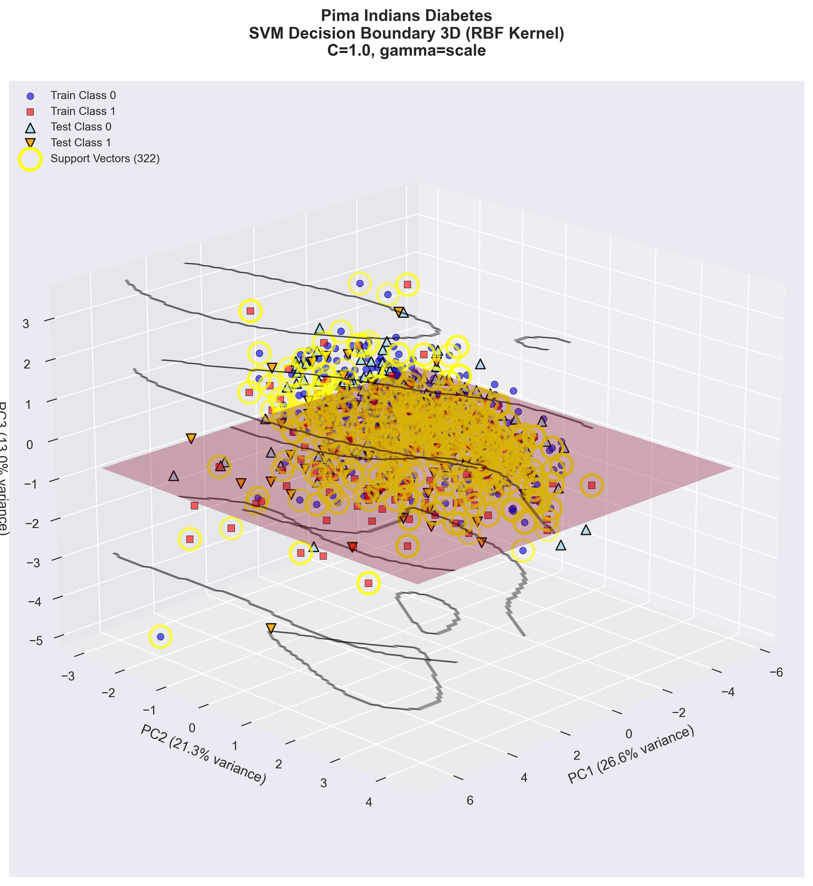

# Raport z klasyfikacji: Decision Tree oraz SVM  
## Zbiory: Banknote Authentication & Pima Indians Diabetes  

Autorzy: **Kamil Suchomski, Kamil Koniak**

---

# 1. Wprowadzenie

Celem projektu jest porównanie działania dwóch klasyfikatorów:

- **Drzewo decyzyjne**
- **Support Vector Machine (SVM)**  

na dwóch zestawach danych o różnym stopniu trudności:

- **Banknote Authentication** – dane prawie liniowo separowalne  
- **Pima Indians Diabetes** – dane silnie nieliniowe, trudniejsze

Oceniono:
- jakość klasyfikacji (accuracy, precision, recall, F1-score),
- wpływ funkcji jądra (kernel functions) w SVM,
- wpływ hiperparametrów,
- granice decyzyjne (2D i 3D)

---

# 2. Eksploracja danych (EDA)

## Banknote Authentication

## Pima Indians Diabetes

---

# 3. Drzewa decyzyjne – analiza wyników

## Banknote Authentication – Decision Tree

**Najważniejsze wyniki:**
- Entropy: accuracy ≈ **0.9927**
- GINI: accuracy ≈ **0.9879**
- Optymalna głębokość: 6–7
- Drzewo lekko przeucza się powyżej głębokości 7

**Wniosek:**  
Zbiór jest łatwy – oba kryteria dają wyniki bliskie 100%.

---

## Pima Indians Diabetes – Decision Tree

**Najważniejsze wyniki:**
- Entropy: accuracy ≈ **0.7316**
- GINI: accuracy ≈ **0.7922**
- Optymalna głębokość: 7
- Dane trudne i podatne na overfitting

**Wniosek:**  
GINI wypada wyraźnie lepiej niż Entropy. Kontrola głębokości jest konieczna.

---

# 4. Support Vector Machine – analiza wyników

## Banknote Authentication – SVM

## Pima Indians Diabetes – SVM

---

# 5. Wizualizacje granic decyzyjnych

## Banknote Authentication – RBF 2D

## Banknote Authentication – RBF 3D

---

## Pima Indians Diabetes – RBF 2D

## Pima Indians Diabetes – RBF 3D

---

# 6. Analiza funkcji jądra (kernel functions) w SVM

Poniżej przedstawiono szczegółowe porównanie dostępnych funkcji jądra oraz ich wpływu na jakość klasyfikacji.

---

## 6.1 Kernel liniowy (Linear)

**Wzór:**  
`K(x, y) = x^T · y`

**Parametr:** `C` ∈ {0.1, 1, 10, 100}

**Wpływ:**
- niskie C → szerokie marginesy, dobra generalizacja  
- wysokie C → wąski margines, ryzyko przeuczenia  

**Zastosowanie:**  
Dane zbliżone do liniowo separowalnych.

**Wniosek:**  
Bardzo dobry baseline. Działa świetnie na Banknote, słabo na Diabetes.

---

## 6.2 Kernel wielomianowy (Polynomial)

**Wzór:**  
`K(x, y) = (γ · x^T · y + coef0)^degree`

**Parametry:**  
- `degree` ∈ {2, 3}  
- `gamma` ∈ {scale, auto}  
- `C` ∈ {1, 10}

**Wpływ:**
- degree=2 → granica kwadratowa  
- degree=3 → najstabilniejszy i najczęściej najlepszy  
- gamma='scale' → najlepsze wyniki  

**Wniosek:**  
Może być skuteczny, ale częściej wolniejszy i bardziej podatny na overfitting niż RBF.

---

## 6.3 Kernel RBF (Radial Basis Function)

**Wzór:**  
`K(x, y) = exp(-γ · ||x - y||²)`

**Parametry:**  
- `C` ∈ {0.1, 1, 10}  
- `gamma` ∈ {scale, auto, 0.01, 0.1}

**Wpływ parametrów:**
- gamma='scale' → najlepszy start  
- niska gamma → gładka granica  
- wysoka gamma → ostre granice → ryzyko overfittingu  
- C=1 → zwykle optimum  

**Wyniki:**  
Najlepszy kernel dla obu zbiorów.

**Wniosek:**  
Najbardziej uniwersalny i najskuteczniejszy kernel.

---

## 6.4 Kernel Sigmoid

**Wzór:**  
`tanh(γ · x^T · y + coef0)`

**Wyniki:**  
- Niestabilny  
- Zwykle słabszy niż inne kern ele  
- Trudny w strojeniu

**Wniosek:**  
Niepolecany jako pierwszy wybór.

---

# 7. Podsumowanie parametrów

### Parametr **C**
- małe C → lepsza generalizacja  
- duże C → ryzyko przeuczenia  
- zalecane: 1–10  

### Parametr **gamma**
- niska gamma → gładkie granice  
- wysoka gamma → ostre granice → overfitting  
- gamma='scale' → najlepszy punkt startowy  

### Parametr **degree (Polynomial)**
- degree=3 → najlepszy kompromis  
- degree>5 → praktycznie bezużyteczne (duży overfitting)

---

# 8. Porównanie klasyfikatorów

## Banknote Authentication
| Model | Accuracy |
|-------|----------|
| Decision Tree | ~0.99 |
| SVM Linear | ~0.99 |
| **SVM RBF** | **1.00** |

**Wniosek:**  
Zbiór bardzo łatwy. Wszystkie modele wypadają świetnie.

---

## Pima Indians Diabetes
| Model | Accuracy |
|-------|----------|
| Decision Tree | 0.73–0.79 |
| SVM Linear | ~0.72 |
| **SVM RBF** | **0.75–0.78** |

**Wniosek:**  
Zbiór nieliniowy – Drzewo decyzyjne wypada dobrze, ale svm rbf wydaje się być stabilniejszy.

