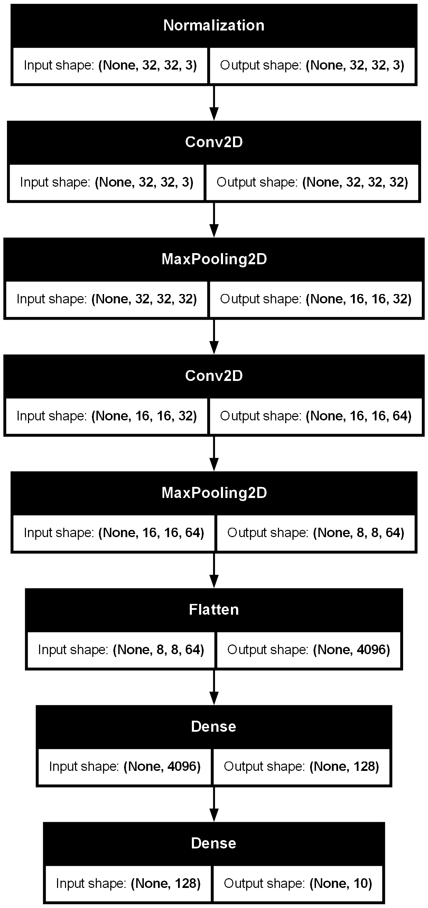
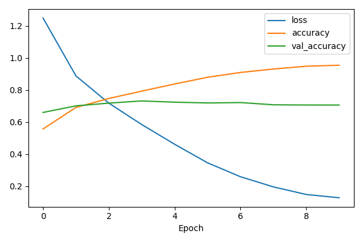
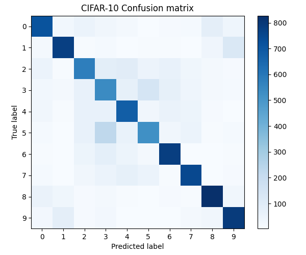
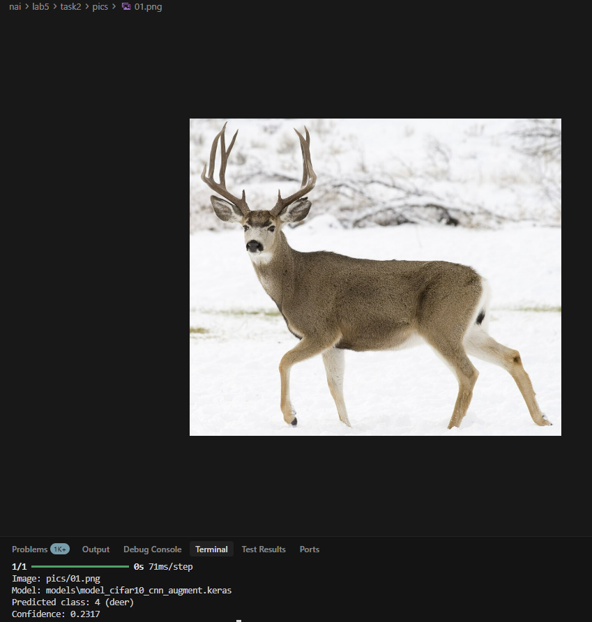
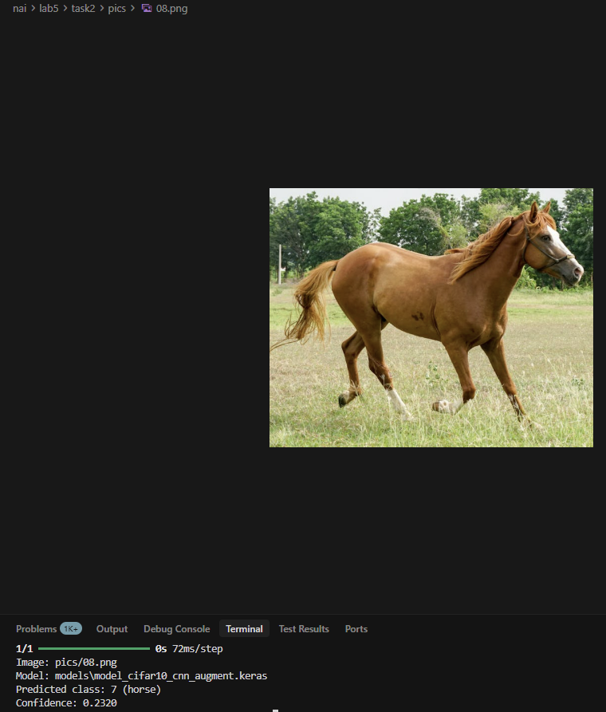

Autorzy:<br>
Kamil Suchomski<br>
Kamil Koniak<br>

Problem:<br>
Naucz sieć rozpoznać zwierzęta.<br>

Rozwiązanie:<br>
Wytrenowaliśmy model z wykorzystaniem zbioru CIFAR10<br>
Model to sieć splotowa korzystająca z augmentacji.<br>
Model jest zapisany w folderze `nai/lab5/task2/models/model_cifar10_cnn_augment.keras`<br>

<br>

Strata na zbiorze testowym: 1.652 <br>
Dokładność na zbiorze testowym: 69,58% <br>
Krzywa uczenia:<br>
<br>
Macież pomyłek:<br>
<br>

W folderze `pics` znajdują się przykładowe zdjęcia do testowania pobrane z internetu.<br>

Aby uruchomić predykcję należy podać ścieżkę do obrazka:
```
cd lab5
cd task2
python predict.py pics\01.png
```

Przykłady użycia:<br>
<br>
<br>
