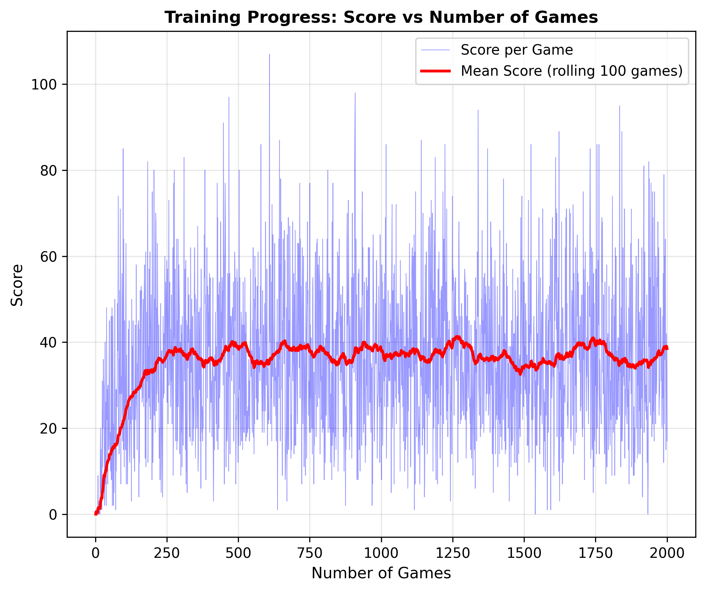

# Autorzy:
Kamil Suchomski s21974 /n
Kamil Koniak s26766

# Problem:

Chcemy stworzyć dobrego gracza w grę Snake

- Nie mamy wiedzy eksperta
- Poziom trudności ustawiony jest na 120 (niemożliwy)
- Gra wymaga szybkiego podejmowania decyzji i natychmiastowych reakcji (góra, dół, lewo lub prawo)
- Wąż musi unikać zderzeń ze ścianami
- Wąż musi zbierać czerwone jabłka, których pozycje są generowane losowo
- Wąż musi unikać zderzeń z własnym ciałem
- Największym problemem jest to, że wąż rośnie o jedną długość za każdym razem, gdy zje jabłko, co zwiększa prawdopodobieństwo zderzenia z samym sobą

# Rozwiązanie:

Projekt zastępuje kontroler logiki rozmytej z laboratorium 2 agentem uczenia ze wzmocnieniem opartym na:
- Algorytmie Deep Q-Learning (DQN)
- Powtarzaniu doświadczeń dla stabilnego treningu
- Sieci neuronowej z architekturą sprzężenia zwrotnego

## Instalacja

1. Instalacja zależności:
```bash
pip install -r requirements.txt
```

## Użycie

### Gra sterowana przez agenta

Uruchomieie gry z agentem:
```bash
python play.py
```

Komenda uruchomi 10 gier z agentem.

### Trening agenta

Tenowanie agenta DQN:
```bash
python train.py
```

Uruchomienie treningu spowoduje:
- Uruchomi 2000 gier
- Zapisze model
- Wygeneruje wykresy postępu treningu
- Zapisze ostateczny model w pliku `models/snake_dqn_final.pth`


### Funkcja nagrody

- **+10**: Spożywanie jedzenia
- **-10**: Kolizja (koniec gry)
- **-0,1**: Każdy krok (zachęca do wydajności)

### Architektura sieci

- Warstwa wejściowa: 11 neuronów (cechy stanu)
- Warstwa ukryta 1: 256 neuronów (aktywacja ReLU)
- Warstwa ukryta 2: 256 neuronów (aktywacja ReLU)
- Warstwa wyjściowa: 3 neurony (wartości Q dla każdej akcji)

### Parametry treningu

- Współczynnik uczenia się: 0,001
- Współczynnik gamma: 0,9
- Epsilon (eksploracja): Zaczyna się od 1,0, zanika do 0,01
- Zanik epsilon: 0,995
- Rozmiar partii: 64
- Aktualizacja sieci docelowej: Co 100 krok

## Kluczowe cechy

1. **Powtórka doświadczeń**: Losowe przechowywanie poprzednich doświadczeń i próbek w celu zapewnienia stabilności treningu
2. **Sieć docelowa**: Oddzielna sieć docelowa dla stabilnej estymacji wartości Q
3. **Eksploracja epsilonowa**: Równoważy eksplorację i eksploatację
4. **Efektywna reprezentacja stanu**: Kompaktowy wektor stanu składający się z 11 cech

## Wyniki

Po treningu agent powinien nauczyć się:
- Unikać ścian i własnego ciała
- Kierować się w stronę pożywienia
- Osiągać wyższe wyniki w czasie

## Postępy w treningu

Wynik / ilośc gier



Średni wynik / ilość gier


## Struktura projektu

```
lab7/
├── snake_game.py      # Środowisko gry
├── rl_agent.py        # Implementacja agenta DQN
├── train.py           # Skrypt trenujący
├── play.py            # Uruchomienie gry z agentem
├── requirements.txt   # Zależności Python
└── README.md          # Ten plik
```

## Bibliografia

**Reinforcement Learning Tutorial** (ResearchGate)
   - Foundational knowledge on RL concepts and algorithms